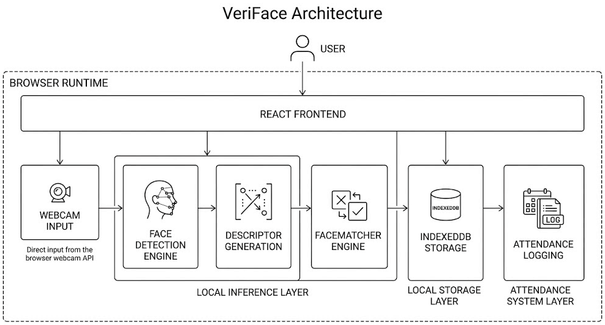
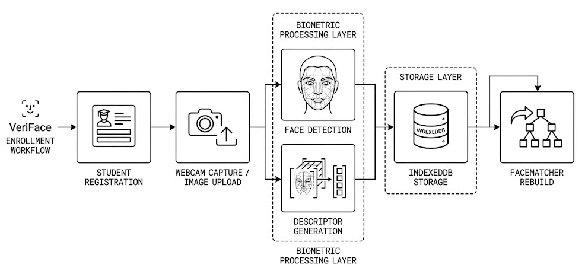
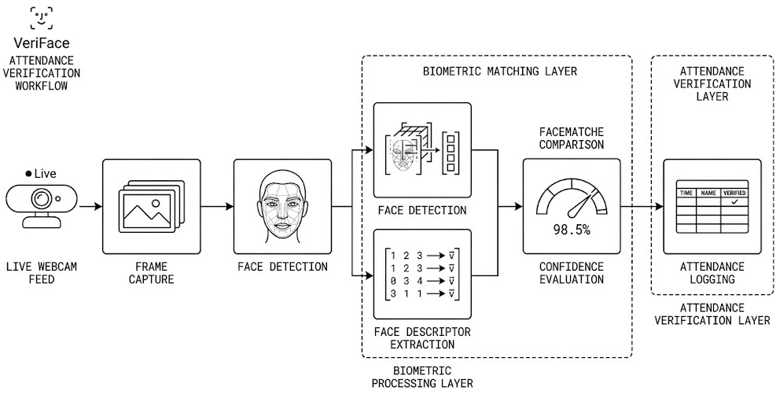
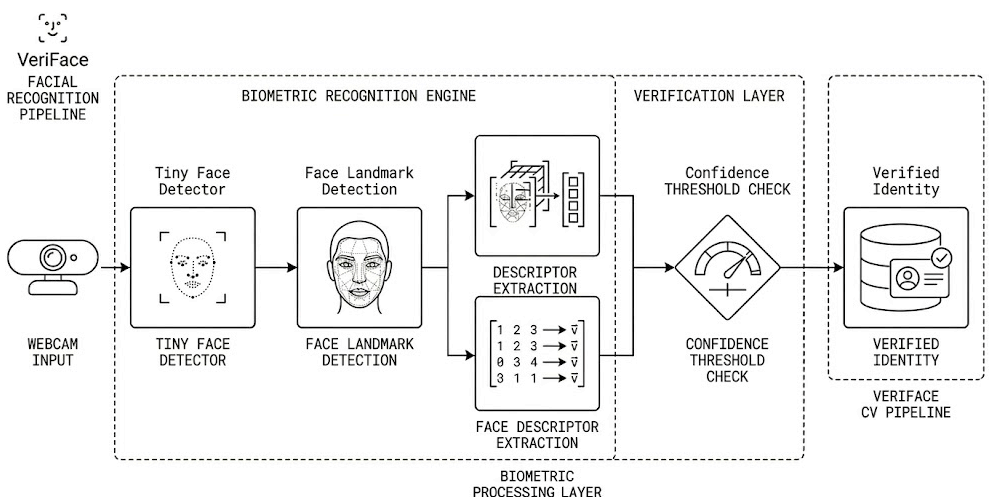
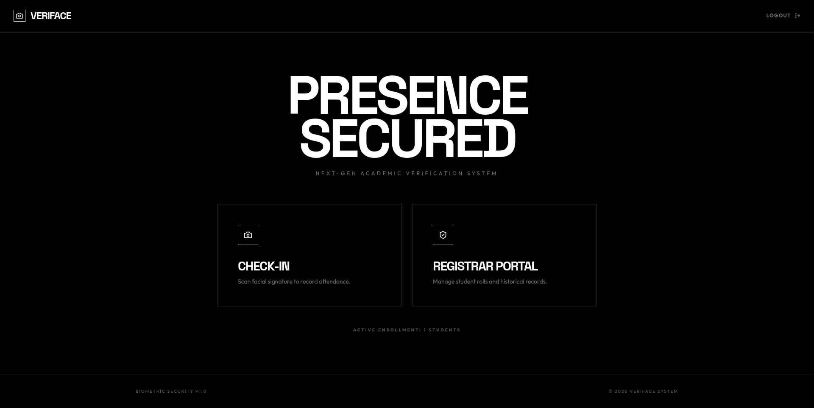
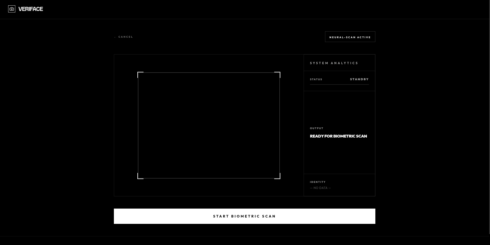
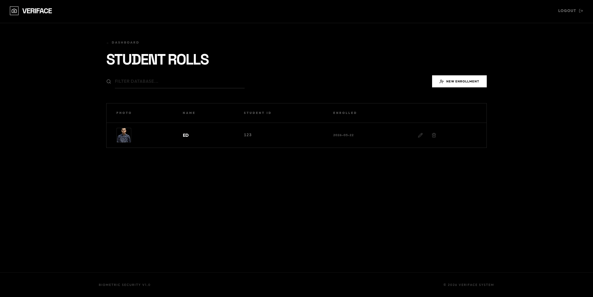
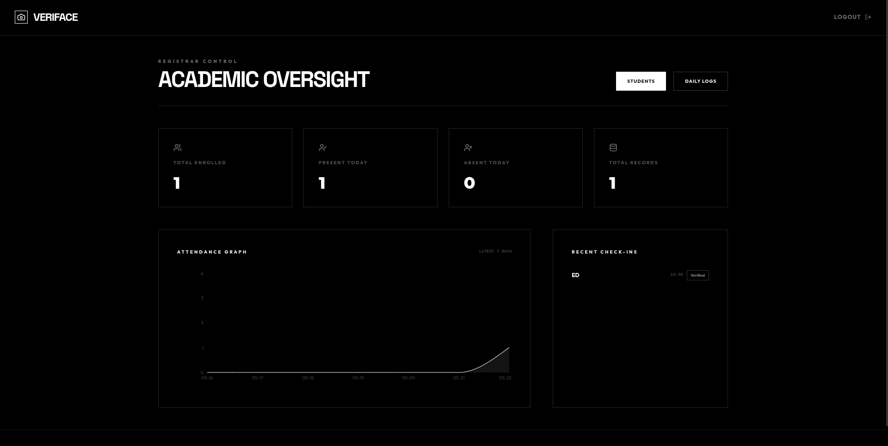
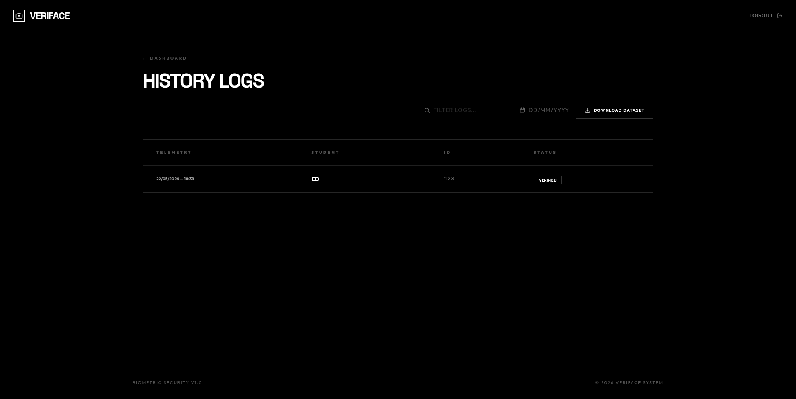

<p align="center">
  
</p>

<h3 align="center">
A browser-based facial attendance platform powered by real-time computer vision and local biometric verification.
</h3>

<p align="center">
  <a href="https://veriface-prod.vercel.app/">Live Demo</a> •
  <a href="#features">Features</a> •
  <a href="#architecture">Architecture</a> •
  <a href="#screenshots">Screenshots</a> •
  <a href="#tech-stack">Tech Stack</a>
</p>

<p align="center">


</p>

---

# Live Demo

### Production Deployment

 https://veriface-prod.vercel.app/

VeriFace is currently deployed as a live browser-based computer vision application using:
- React + Vite frontend
- face-api.js inference
- TensorFlow.js
- IndexedDB persistence
- local biometric verification workflows

---

# What is VeriFace?

VeriFace is a browser-based facial attendance system designed for classrooms, academic institutions, and training environments.

The platform uses real-time face recognition directly in the browser to:
- enroll students
- verify attendance
- prevent duplicate check-ins
- maintain attendance logs
- provide analytics and audit trails

Unlike traditional attendance systems that rely on manual input or QR-based verification, VeriFace focuses on:
- biometric verification
- local inference
- offline-friendly workflows
- real-time recognition
- lightweight deployment

The entire recognition pipeline runs locally in the browser using face-api.js and IndexedDB without requiring a backend inference server.

---

# Try It Yourself

### Demo Credentials

Admin Panel Password:

```text
admin123
```

---

### How VeriFace Works

1. Open the live demo
2. Enter the Registrar Portal
3. Use the admin password
4. Enroll a student using:
   - webcam capture
   - image upload
5. Open the Scanner
6. Scan the enrolled face
7. Attendance is verified locally in the browser

---

### Privacy & Local Storage

VeriFace currently works entirely in the browser.

This means:
- face descriptors are stored locally
- attendance records stay in your browser
- no cloud biometric processing
- no external face recognition API calls
- no server-side face storage

The system uses:
- IndexedDB
- browser-side inference
- local descriptor matching

for an offline-friendly and privacy-focused workflow.

---

# Why I Built This

Traditional attendance systems are often:
- slow
- easy to manipulate
- dependent on manual verification
- difficult to manage at scale

I wanted to explore how browser-based computer vision could be used to create a faster and more reliable attendance workflow without relying on heavy infrastructure or cloud-based face processing.

The goal was to build a system that:
- performs real-time facial verification
- works locally in the browser
- minimizes setup complexity
- maintains attendance integrity
- feels modern and practical

VeriFace started as an experiment in browser-side face recognition and gradually evolved into a complete attendance management platform with analytics, audit logs, enrollment workflows, and biometric verification.

---

# Features

## Real-Time Face Recognition

VeriFace uses live webcam input and local facial descriptor matching for attendance verification.

### Features
- Live webcam scanning
- Real-time face detection
- Browser-side facial recognition
- Descriptor-based matching
- Confidence verification
- Duplicate attendance prevention

---

## Student Enrollment System

Students can be enrolled directly through webcam capture or uploaded images.

### Features
- Face registration
- Image upload support
- Descriptor generation
- Student editing workflows
- Student deletion and updates
- Automatic matcher rebuilding

---

## Attendance Dashboard

The dashboard provides attendance analytics and tracking tools.

### Features
- Attendance totals
- Recent check-ins
- 7-day activity trends
- Student enrollment counts
- Attendance monitoring
- Quick navigation workflows

---

## Attendance Logs & Audit Trail

VeriFace maintains searchable attendance history records.

### Features
- Attendance history
- Date-based filtering
- Search functionality
- Calendar filtering
- CSV export
- Audit trail workflows

---

## Admin Access System

The platform includes a lightweight admin workflow for managing records and enrollment operations.

### Features
- Admin authentication
- Protected management workflows
- Student management
- Attendance oversight
- Administrative navigation

---

# Architecture

## High-Level System Architecture

<p align="center">
  
</p>

---

## Enrollment Pipeline

<p align="center">
  
</p>

---

## Attendance Verification Pipeline

<p align="center">
  
</p>

---

## Face Recognition Pipeline

<p align="center">
  
</p>

---

# Face Recognition System

The recognition system is powered by:
- face-api.js
- TensorFlow.js
- Tiny Face Detector
- Face Landmark 68
- Face Recognition models

The workflow operates entirely inside the browser.

### Recognition Workflow

- Webcam frames are captured using `getUserMedia`
- A face descriptor is generated from the detected face
- The descriptor is matched against locally stored student descriptors
- Attendance is verified using distance threshold matching
- Verified students are logged into attendance records

The matcher architecture rebuilds automatically whenever:
- a student is added
- student data changes
- descriptors are updated
- students are removed

---

# Key Engineering Highlights

- Built browser-side biometric inference using face-api.js
- Implemented real-time descriptor matching and confidence evaluation
- Designed local-first attendance persistence using IndexedDB
- Added duplicate attendance prevention using composite indexing
- Built enrollment and editing workflows with automatic matcher rebuilding
- Implemented attendance analytics and CSV export workflows
- Managed webcam lifecycle handling and React StrictMode cleanup behavior

---

# Tech Stack

## Frontend
- React 19
- Vite
- Tailwind CSS
- GSAP
- Lucide React
- Recharts

---

## Computer Vision
- face-api.js
- TensorFlow.js
- Tiny Face Detector
- Face Landmark 68
- Face Recognition Models

---

## Storage & Persistence
- IndexedDB
- Dexie.js
- UUID

---

# Repository Structure

```bash
veriface/
│
├── docs/
│   ├── assets/
│   ├── diagrams/
│   └── screenshots/
│
├── public/
│   └── models/
│
├── src/
│   ├── components/
│   ├── lib/
│   ├── pages/
│   ├── App.jsx
│   └── main.jsx
│
├── package.json
├── vite.config.js
└── README.md
```

---

# Screenshots

## Home Screen

<p align="center">
  
</p>

---

## Live Face Scanner

<p align="center">
  
</p>

---

## Student Enrollment System

<p align="center">
  
</p>

---

## Attendance Dashboard

<p align="center">
  
</p>

---

## Attendance Logs

<p align="center">
  
</p>

---

# Data Model

## Student Records

Stored student data includes:
- student name
- student ID
- face descriptors
- enrollment timestamps
- stored photo data

---

## Attendance Records

Attendance records store:
- student identity
- attendance timestamp
- attendance date
- attendance history

The system also uses composite indexing to prevent duplicate attendance submissions for the same student on the same day.

---

# Engineering Challenges

## Browser-Based Computer Vision

One of the biggest challenges was implementing real-time facial recognition entirely inside the browser while maintaining acceptable performance and responsiveness.

This required:
- optimized model loading
- lightweight inference workflows
- efficient descriptor matching
- webcam lifecycle management

---

## Descriptor Matching & Verification

The system uses descriptor-based identity matching instead of image comparison.

Challenges included:
- handling recognition confidence
- preventing false positives
- rebuilding matcher state after edits
- managing recognition consistency across sessions

---

## Local-First Persistence

Instead of relying on cloud infrastructure, VeriFace stores attendance and biometric metadata locally using IndexedDB.

This introduced challenges around:
- data consistency
- browser persistence
- migration workflows
- matcher synchronization

---

## Webcam Lifecycle Handling

Managing webcam streams inside React introduced issues around:
- stream cleanup
- React StrictMode double mounting
- memory leaks
- camera reinitialization

The scanner system includes cleanup and lifecycle handling to keep the camera stable across navigation and re-renders.

---

# Limitations & Future Improvements

Current limitations:
- no liveness detection
- single-face recognition only
- local browser storage only
- no cloud synchronization
- no backend authentication layer

Planned improvements:
- backend synchronization
- multi-device support
- liveness detection
- role-based access control
- cloud attendance backup
- multi-face detection
- deployment-ready infrastructure

---

# Project Positioning

VeriFace is best positioned as:
- a browser-based computer vision platform
- an educational technology system
- a biometric attendance solution
- a real-time facial verification project

The strongest technical aspect of the project is the implementation of local biometric inference and descriptor matching directly inside the browser without relying on cloud AI services.

---

# Project Status

> Active Development

VeriFace continues evolving with improvements across:
- recognition accuracy
- attendance workflows
- local inference performance
- analytics
- biometric verification systems

---

# Author

## Ehaan Dadarkar

- Portfolio: https://ed-port.vercel.app
- LinkedIn: https://linkedin.com/in/ehaan-dadarkar-1694a8351
- GitHub: https://github.com/Ehaan-Dadarkar